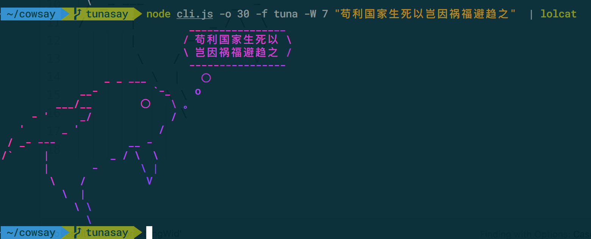

# tunasay

tunasay is a fork of nodejs version of [cowsay](https://github.com/piuccio/cowsay), the nodejs translation of cowsay. The original version of cowsay was written in Perl by [Tony Monroe](https://github.com/tnalpgge/rank-amateur-cowsay). In general, tunasay provides a configurable talking tuna.

tunasay provides two new ASCII arts created by @dotkrnl to the original cowsay and added a new option `-o`, balloon padding.

## Usage

    tunasay "TUNA Rocks!"

```
                               _____________
                              < TUNA Rocks! >
                               -------------
                 _ _ ___         〇
             __-         `-_    o
         ___/__        〇   \ 。
     - '     _/             /
   '      _ '             /
 / _- ---            __ -
/`     |          _ / \  \
       |       -       \ |
        \    /          V
          \  |
            \ \
              \
```

Advanced usage:

    tunasay -W 7 "苟利国家生死以岂因祸福避趋之"  | lolcat

`-W` option indicates that the text should be wrapped at the 7th character.



## Install

    npm install -g tunasay

## Pipe from standard input

    echo please repeat | tunasay
